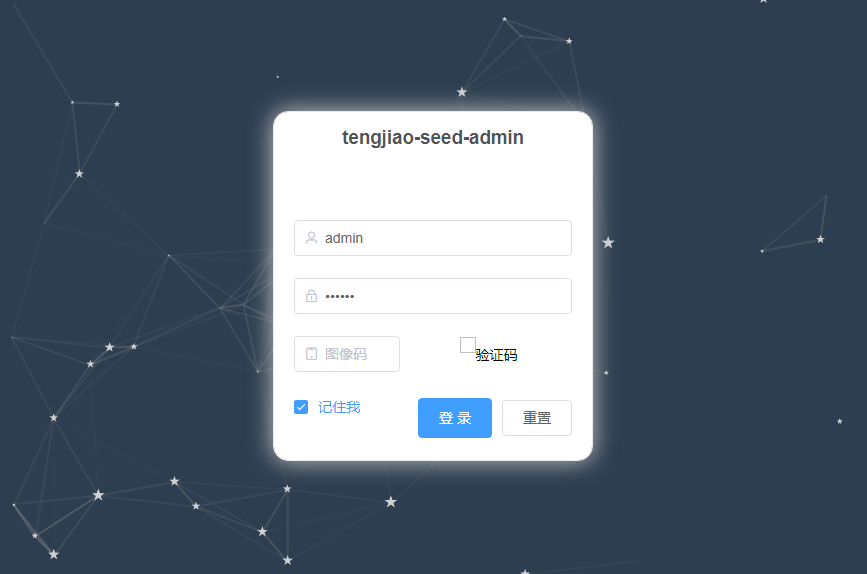
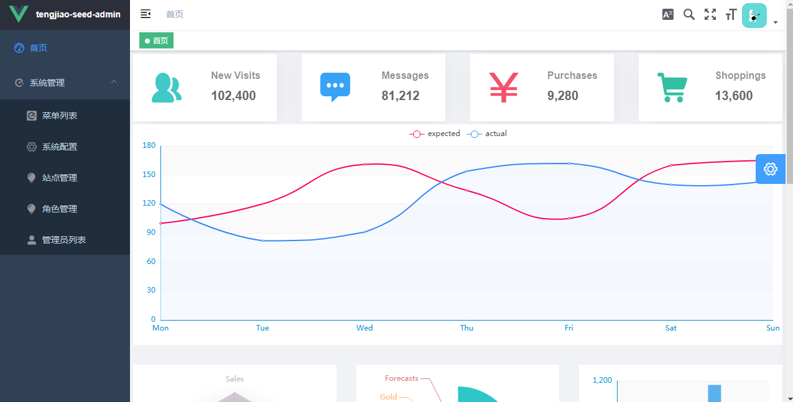
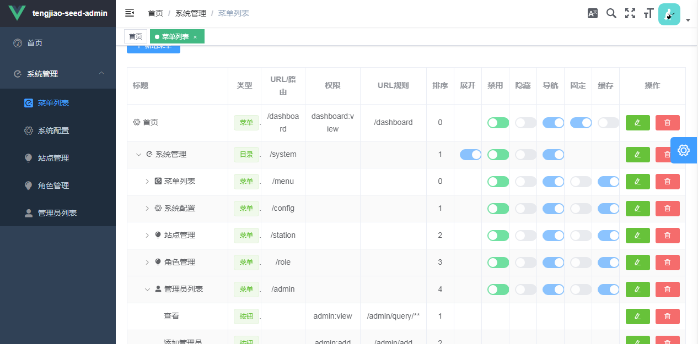
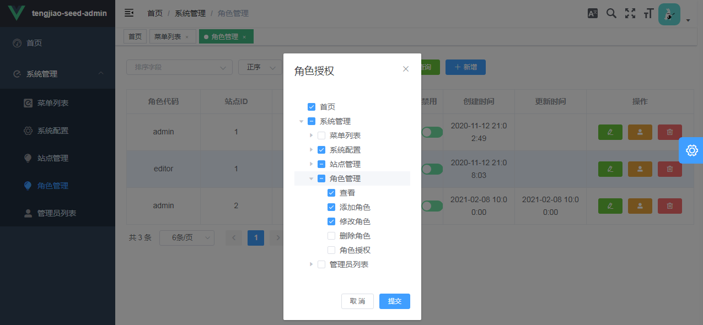
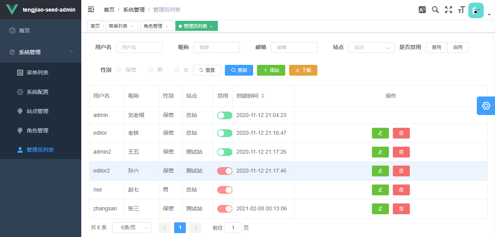

# 1. 介绍
## 1.1. 运行效果
### 1.1.1. 登录界面

### 1.1.2. 首页面板

### 1.1.3. 菜单列表

### 1.1.4. 角色管理

### 1.1.5. 管理员列表

## 1.2. 目录介绍
|          文件           |                        备注                        |
| ----------------------- | ------------------------------------------------- |
| tengjiao-seed-admin-sample.jar | 主程序                                             |
| config/                 | 存放主程序配置文件                                  |
| lib/                    | 存放主程序依赖库                                    |
| static/                 | 存放静态资源文件，这是实际上主要存放vue单页打包后的资源 |
| redis-64.3.0.503/       | 第三方软件redis，缓存                               |
| redis.bat               | redis启动脚本                                      |
| tengjiao-seed-admin-sample.bat | 主程序启动脚本                                      |
| 一键启动所有.bat         | 先启动redis后启动主程序                          |
## 1.3. 技术选型
|         |                            |
| ------- | -------------------------- |
| MVC     | mybatisplus+springboot+vue |
| 权限认证 | springsecurity             |
| 数据库   | h2，仅用于演示              |
## 1.4. 使用说明
安装jdk8，
双击 一键启动所有.bat，
访问 http://localhost:8080，
输入账号密码 admin/123456，
点击验证码，输入验证码。
登录
!注意：重启后数据会重新初始化
## 1.5. 完整下载
链接: https://pan.baidu.com/s/1gvVPVW0OGSjQFpcbdyavdw 提取码: 8ydk